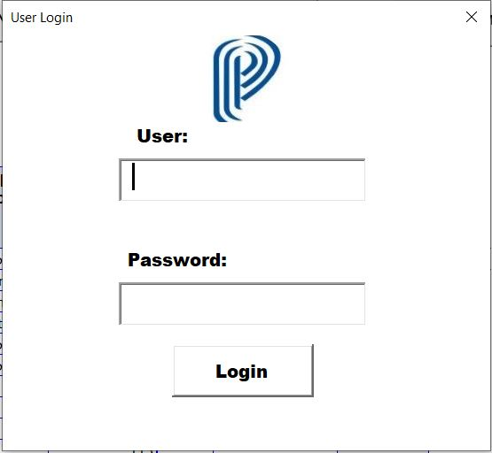
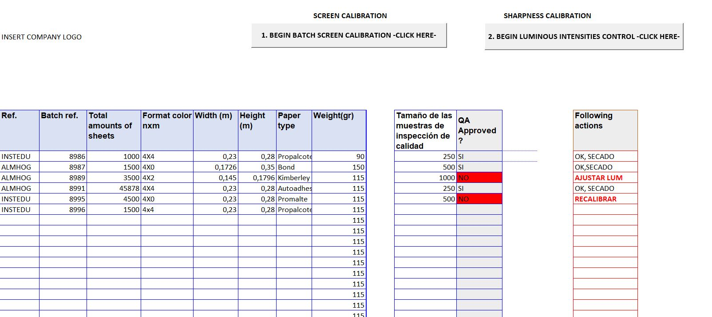
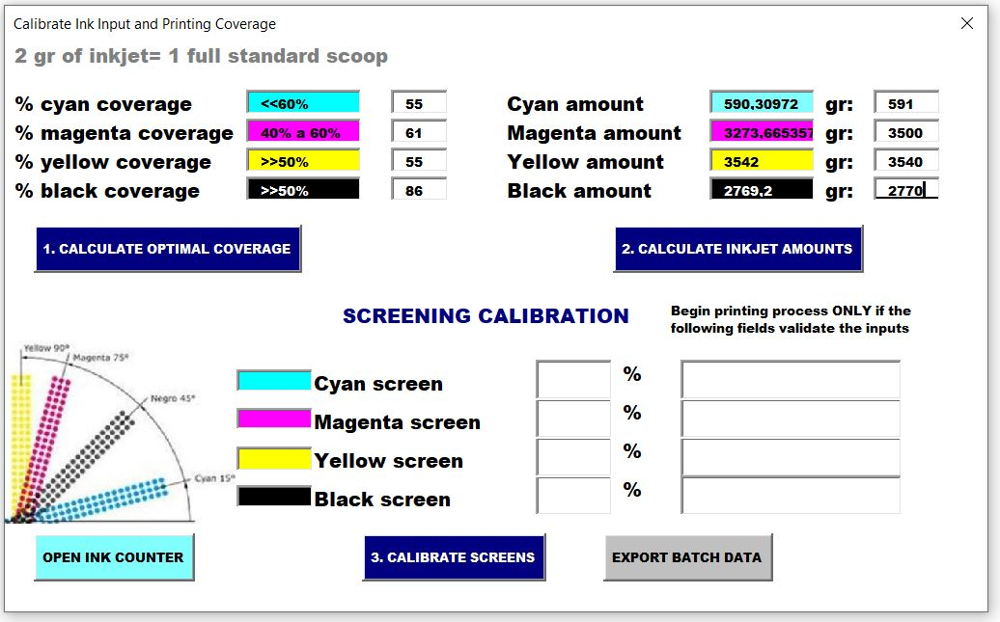
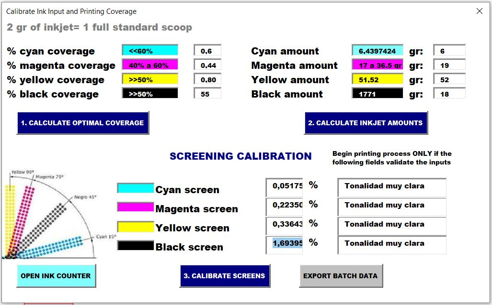
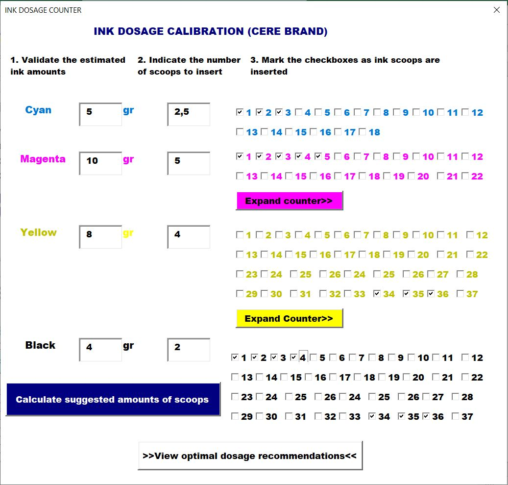
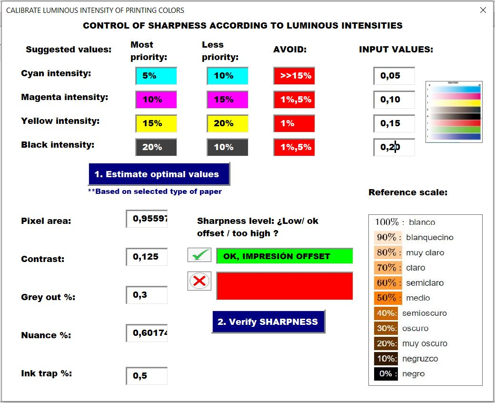

# Printing Process Savings App
Business solution that estimates resource savings and warns about overconsumptions during a batch printing process. 
It consists of five windows forms with user inputs and built-in automation for the following purposes:
1. Based on input printing parameters suggest the optimal amounts of raw material to use for a production cycle
2. Calibrate printing color screens indicating the user if the production cycle should be started
3. Provide a user form to count the amounts of scoops inserted to the press
4. Provide a user form to explain the operation step-by-step
5. Calculate the optimal sharpness levels based on input printing parameters
6. Verify the color intensities input by the user

## Usage
Import .frm and .frx files into VBA Excel developer environment. In order to load the user forms with worksheet ActiveX buttons, module1 and module3 .bas files must also be added.
The following packages must be installed in the code compiler to execute all the runtime VB macros:

1. Microsoft Excel 16.0 Object Library
2. VBA OLE Automation library
3. Microsoft Windows Forms 2.0 Object library
4. AppxManagerLib
5. Microsoft ActiveX Data Objects 6.1 library

## Layout

### User Login
 

 

### Load User Forms View
 

 

### Calibration Control User Interface
 

 

Calibration sample output:

 

### Input Control User Interface
 

 

### Onsite Parameters Control User Interface
 

 

 

